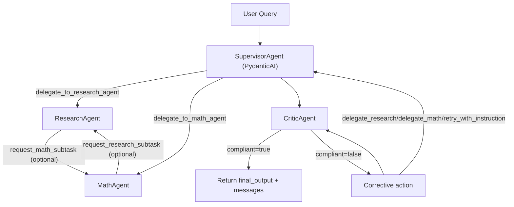

# Pydantic Supervisor

A multi-agent supervisor system built with PydanticAI that routes user tasks between:

- `ResearchAgent` (Tavily-backed web search)
- `MathAgent` (arithmetic tools)
- `Supervisor Agent` (routing + synthesis)
- `CriticAgent` (post-response delegation/tool-use validator)

This repository includes:

- local interactive runner for the multi-agent supervisor workflow
- Braintrust eval suites and reusable scorers
- Modal remote eval server integration
- configurable prompts/models through eval parameters

## Quick Start

1. Install dependencies:

```bash
pip install -r requirements.txt
```

2. Configure environment:

```bash
cp .env.example .env
```

Required keys:

- `GEMINI_API_KEY` or `GOOGLE_API_KEY`
- `TAVILY_API_KEY`
- `BRAINTRUST_API_KEY` (if tracing/evals)
- `OPENAI_API_KEY` (used by judge scorers)
- Optional: `TRACE_PROFILE=full|lean` (default `full`)
  - `full`: Braintrust `setup_pydantic_ai(...)` auto-instrumentation (verbose)
  - `lean`: explicit app spans only (invocation, handoff, llm_response_generation, tool_routing_decision)

3. Run local chat:

```bash
python -m src.local_runner
```

## Architecture



Runtime notes:

- Handoff spans remain explicit and stable: `handoff [ResearchAgent]`, `handoff [MathAgent]`.
- Critic validation is in-loop before final return, with `critic [CriticAgent]` task spans.
- Returned payload contract includes `final_output` and `messages`.

## Evals

Run full supervisor eval:

```bash
braintrust eval evals/eval_supervisor.py
```

Run focused eval suites:

```bash
braintrust eval evals/eval_math_agent.py
braintrust eval evals/eval_research_agent.py
```

## Remote Eval Server (Modal)

Deploy:

```bash
modal deploy src/eval_server.py
```

Local serve:

```bash
modal serve src/eval_server.py
```

Then connect the endpoint from Braintrust Playground remote eval UI.

## Interactive Queries On Modal

After deploying `src/eval_server.py`, you can query the live multi-agent app directly:

- Browser UI: `https://<your-modal-url>/interactive`
- JSON API: `POST https://<your-modal-url>/interactive/query`

Example:

```bash
curl -X POST "https://<your-modal-url>/interactive/query" \
  -H "content-type: application/json" \
  -d '{"query":"What is 12*9?","workflow_name":"pydantic-supervisor-interactive"}'
```

Response includes:

- `final_output` (assistant answer)
- `messages` (serialized user/assistant/tool events)
- trace logging to Braintrust via PydanticAI instrumentation

## Project Layout

- `src/agents/` - supervisor + specialist agent construction
- `src/agents/critic_agent.py` - critic agent prompt + construction
- `src/helpers.py` - PydanticAI run loop + event serialization into eval message schema
- `evals/` - Braintrust eval tasks and scorers
- `src/eval_server.py` - Modal ASGI remote eval server
- `scorers.py` - reusable published scorers

## Notes

- Output contract: `{"final_output": str, "messages": [...]}` for scorer compatibility and UI.
- Routing inference relies on span/tool-call names (`research`, `math`, `delegate_to_*`, `tavily_search`, arithmetic tool names).
